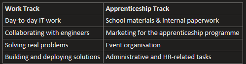

#  Entry #6: Work Updates

**How is your apprenticeship going in your second year so far?**

My second year is going reasonably well overall. Management has been a source of frustration, but we keep our heads up and work through the challenges as they come. One of the more demanding aspects has been pushing back against tasks that were poorly suited for IT apprentices — advocating for more appropriate and meaningful work. It was a tough fight, but over the last two months we've made real progress in establishing ourselves as a more respected team, no longer being pulled in every direction without purpose.

**What are some things or skills you have recently learned at your work?**

One area I've recently been exposed to is licence management. It's not typically part of my day-to-day responsibilities — we have a dedicated team that handles it — but I gained a solid understanding of how it works and why it matters. The core goal is maintaining an optimised software environment: ensuring everything is properly licensed, costs are kept under control, and we're getting the best value for what the company spends.

**What is the biggest challenge in your job, and how can you overcome it?**

The biggest challenges I currently face aren't technical — they're organisational. There's a running joke among airport apprentices that you haven't truly worked here until you've been written up for something trivial. It captures a real structural problem.

These two tracks are managed by entirely different people, who operate differently and have different impacts on our development and careers. The critical flaw is that neither side has visibility into what the other is doing — and we, as apprentices, end up stuck in the middle absorbing the friction.
When you add a difficult manager into that already fragmented structure, it creates a situation where you can be performing well on the job while simultaneously being written up over minor issues on the administrative side. I deal with it with a degree of humour, but it's a genuine structural problem worth addressing through clearer communication and better coordination between both sides.

**What can you do to improve your own performance?**

I receive a lot of feedback, which makes it challenging to identify what's actually actionable. That said, one concrete area for improvement is time management — planning my work more deliberately rather than reacting to whatever comes in. I'll acknowledge that I perform well under pressure and find it motivating, but relying on that as a default isn't a sustainable strategy. Structured planning would help me maintain that performance level consistently, not just when deadlines force it.

